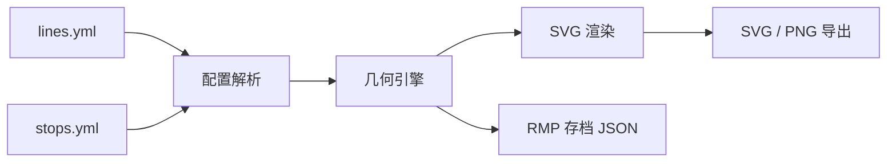

<div align="center">


<br />
<br />

**一个零依赖的浏览器工具：读取 Minecraft 服务器 Metro 地铁插件的 `lines.yml` / `stops.yml`，自动绘制并导出专业级地铁线网图。**

<br />


</div>

---

## 简介

Metro 线网工坊（Metro Map Studio）面向使用 [Metro](https://github.com/CubeX-MC/Metro) 地铁插件的 Minecraft 服务器：把 `plugins/Metro/lines.yml` 与 `stops.yml` 拖进页面，工具便会自动完成世界坐标投影、并行线路偏移、站名碰撞避让与线路图例排版，输出一张可以直接使用的线网图。

整个工具由原生 JavaScript 编写：没有框架、没有打包步骤、没有第三方依赖。双击 `index.html` 即可使用，也可以部署到任意静态目录。

## 功能特性

| 能力 | 说明 |
| --- | --- |
| 配置直读 | 兼容现行 `RoutePoint` 格式与 1.1.x 旧版 `corner1/corner2` 格式，兼容 Bukkit 零缩进列表；自动忽略未被线路引用的停靠区 |
| 自动配图 | 世界坐标投影、45 度折线化、直角折线、并行线路自动偏移、站名四方向避让 |
| 三种绘制模式 | 「实际走向」「45 度示意图」「直角折线」一键切换 |
| 多世界支持 | 自动识别配置中的世界，也可手动指定要绘制的世界 |
| 换乘识别 | 共享站点或 `transferable_lines` 标记为换乘站；统计区列出站名并绘制大圈 |
| 交叉避混 | 非换乘线路交叉处断开下层线路，避免误读为换乘 |
| 站名避线 | 站名候选位置避开线路笔画，并考虑当前线宽留出间距 |
| 自动配色 | 线路全部同色或为默认白色时，按“线路组”（上行 / 下行视为一组）自动分配预览配色 |
| 三格式导出 | SVG 矢量、PNG 位图（1x / 2x / 3x，可选透明背景）、RMP 存档 JSON |
| 多语言界面 | 界面、提示信息与导出地图文本支持 Türkçe、English 和简体中文；可在顶栏切换，语言偏好保存在当前浏览器 |
| 内置自检 | `tests/selftest.html` 覆盖解析、几何、渲染与导出的 20 项用例 |
| 零依赖部署 | 纯原生 JavaScript，可放在任意静态目录或直接本地打开 |

界面采用 Neo-Brutalism 视觉语言：硬边框、硬投影与高对比色块。

## 快速开始

1. 获取本仓库（下载或 `git clone`）；
2. 双击 `index.html`，浏览器中即出现内置示例的线网图；
3. 将服务器目录 `plugins/Metro/` 下的 `lines.yml` 与 `stops.yml` 拖入左侧导入区；
4. 按需调整标题、世界、绘制模式与外观选项，然后导出 SVG / PNG / RMP。

> 也可以把两个文件的内容直接粘贴到「或粘贴文本导入」区域。

## Languages / Dil desteği

The interface is available in **Turkish**, **English**, and **Simplified Chinese**. Use the language selector in the top bar; your choice is saved in the current browser.

Arayüz **Türkçe**, **İngilizce** ve **Basitleştirilmiş Çince** olarak kullanılabilir. Üst çubuktaki dil menüsünden seçim yapın; tercihiniz bu tarayıcıda saklanır.

界面支持**简体中文**、**土耳其语**和**英语**。可在顶部语言菜单中切换，选择会保存在当前浏览器中。

## 工作流程



## 三种绘制模式

| 模式 | 说明 | 适用场景 |
| --- | --- | --- |
| 实际走向 | 按真实坐标绘制，包含录制轨迹的走向 | 服务器实景对照、工程校核 |
| 45 度示意图 | 自动将线路折线化为 45 度与水平 / 垂直段 | 海报、公告、玩家导览 |
| 直角折线 | 全部由水平 / 垂直段与 90 度转角构成（与 RMP perpendicular 一致） | 硬朗直角风格、配合 RMP 导出 |

## 导出格式

| 格式 | 类型 | 用途 |
| --- | --- | --- |
| `*.svg` | 矢量图 | 印刷、继续二次编辑 |
| `*.png` | 位图 | 群公告、论坛发图（支持 1x / 2x / 3x 与透明背景） |
| `*-rmp.json` | Rail Map Painter 存档 | 导入 [railmapgen.github.io/rmp](https://railmapgen.github.io/rmp/)，用官方站型素材继续美化 |

## 目录结构

```text
.
├── index.html          入口页面，双击即用
├── css/style.css       Neo-Brutalism 视觉系统
├── js/
│   ├── i18n.js         Türkçe / English 界面与导出文本
│   ├── yaml-lite.js    YAML 子集解析器（兼容 Bukkit 配置）
│   ├── metro-config.js Metro 配置解析（现行与旧版格式）
│   ├── geo.js          几何引擎（投影、折线化、直角化、并行偏移、站名避让）
│   ├── svg-render.js   SVG 渲染（线路、车站、图例、比例尺、指北针）
│   ├── rmp-export.js   Rail Map Painter 存档导出
│   ├── sample-data.js  内置示例数据
│   └── app.js          界面逻辑与导出
├── assets/
│   ├── logo.svg        项目标志
│   └── banner.svg      README 横幅
├── samples/            示例配置
└── tests/
    └── selftest.html   自检页面（20 项用例）
```

## 自检

打开 `tests/selftest.html`，全部用例会在页面加载时运行，并渲染一张示例线网图。当前 20 项用例覆盖：

- YAML 解析（注释、引号、`&` 颜色值、Bukkit 风格零缩进列表）；
- Metro 配置解析（现行与旧版键名、引用缺失站台时的告警）；
- 几何计算（实际走向、45 度折线化、直角折线、并行区段偏移、自动配色、交叉与换乘判别）；
- 渲染（SVG 完整性、站名碰撞避让与线路避让）；
- RMP 导出（节点、边、路径类型与颜色字段）；
- 边界情况（空配置、幽灵站台）。

## 常见问题

**图是空白的？**

检查所选世界是否包含停靠区。工具默认选择停靠区最多的世界，也可以在下拉框中手动切换。

**站名互相压叠？**

适当调小「站名字号」，或在导出 SVG 后放大画布。站名摆放采用四方向碰撞避让，个别密集区域仍可能需要手动微调。

**RMP 存档怎么继续编辑？**

打开 [railmapgen.github.io/rmp](https://railmapgen.github.io/rmp/)，通过右上角「导入」选择导出的 JSON，即可套用官方站型与配色继续排版。

**为什么线路不是直角？**

「实际走向」按服务器录制的真实轨迹绘制（含弯道与斜线）；「45 度示意图」会保留 45 度斜线，这两种模式出现斜线都是预期效果。想要全部由水平 / 垂直段与 90 度转角构成的线型，请选择「直角折线」模式；导出 Rail Map Painter 时把「RMP 路径」选为「直角折线（perpendicular）」，可保持同样的直角效果。

**线路交叉处是换乘站吗？**

不是。只有共享同一站点或 `stops.yml` 的 `transferable_lines` 明确关联的线路才会识别为换乘；普通几何交叉会在下层线路留出断口，统计区也会列出换乘站名称。地图保留原始站点坐标，不会为了避开交叉而移动车站。

**为什么预览里的线路颜色和游戏里不一样？**

当所有线路的颜色相同或为默认白色（`&f`）时，工具会自动按“线路组”（同一线路的上行 / 下行视为一组）分配一组预览配色，方便看图。在左侧取消勾选「自动配色」即可按配置文件原色显示；此调整仅影响预览与导出图，不会写回配置文件。

**支持旧版 Metro 数据吗？**

支持。解析器会同时识别现行 `RoutePoint` 与 1.1.x 的 `corner1/corner2` 键名。

## 致谢

Metro 线网工坊建立在以下项目与社区的工作之上（页面右上角「致谢与作者」中亦有同名清单）：

| 项目 | 角色 |
| --- | --- |
| [CubeX-MC/Metro](https://github.com/CubeX-MC/Metro) | 数据来源：`lines.yml` / `stops.yml` 的数据结构与站点体系 |
| [railmapgen/rmg](https://github.com/railmapgen/rmg) · [railmapgen/rmp](https://github.com/railmapgen/rmp) | 设计参考：线网图绘制方法论、视觉风格与导出目标 |
| 阿清 | 作者：需求整理、解析、几何算法与渲染实现 |
| 清屿服务器玩家们 | 测试与反馈 |

本工具为独立实现，与上述项目无隶属关系。

## 许可证

[MIT](LICENSE)
